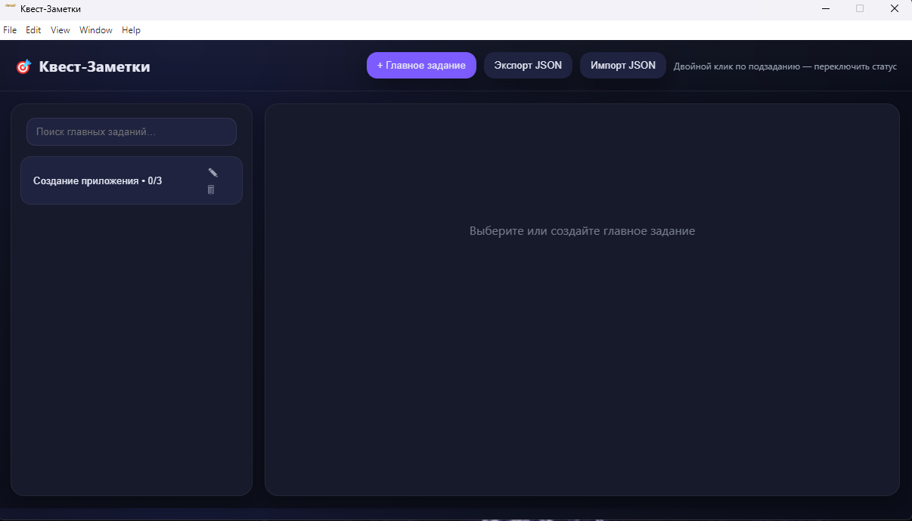
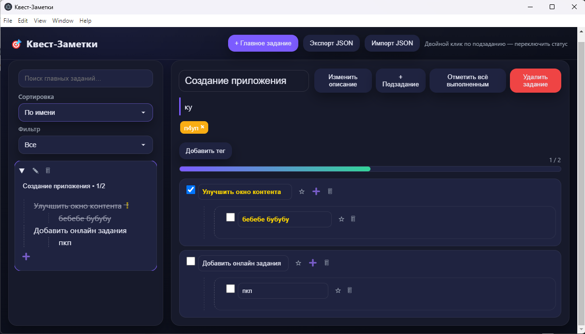

# 🎯 Quest Notes

> Приложение для управления задачами в стиле квестов.  
> Написано на **Electron + JavaScript**.

---

## 🚀 Возможности

- ✅ Создание главных заданий и подзаданий  
- ✅ Прогресс-бар выполнения квеста  
- ✅ Редактирование и удаление задач  
- ✅ Горячие клавиши (ESC, Enter)  
- ✅ Поиск по задачам  
- ✅ Импорт / экспорт данных в формате JSON  
- ✅ Автосохранение в локальные файлы  
- ✅ Сортировка и фильтр заданий

---

## 🖼️ Скриншоты

| Главный экран | Меню задания |
|---------------|-------------------|
|  |  |

---

## ⚙️ Установка и запуск

```bash
# Установка зависимостей
npm install

# Запуск приложения
npm start

# Сборка установщика (Windows)
npm run dist
